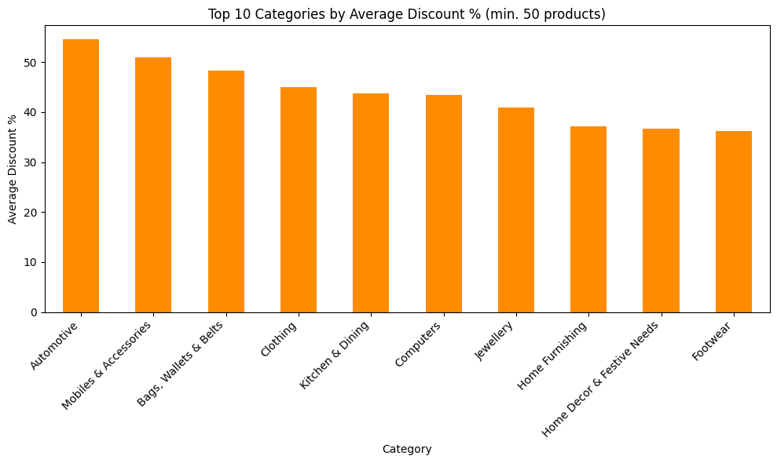
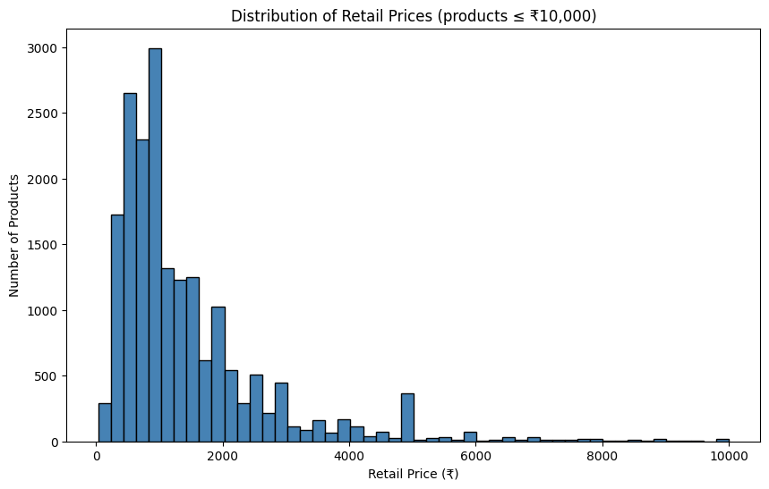
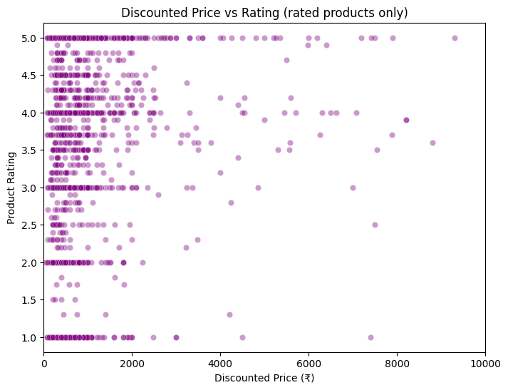
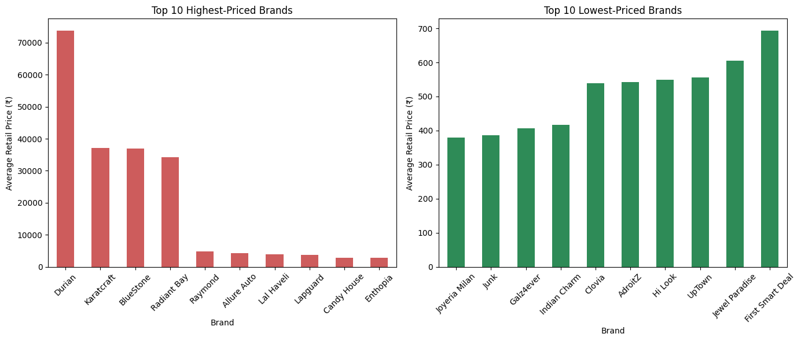

# Flipkart E-commerce Pricing Analysis

## Highlights
- Analyzed ~20,000 Flipkart product listings across 20+ categories
- Average discount across the catalog is ~40%, with Automotive discounting steepest (~54%)
- Found price has almost no relationship with product rating (0.057 correlation)

## Business Problem
What does Flipkart's pricing and discounting strategy look like across categories and brands — and does price actually predict customer satisfaction?

## Dataset
Flipkart E-commerce Dataset — Kaggle (https://www.kaggle.com/datasets/atharvjairath/flipkart-ecommerce-dataset)
~20,000 product listings, 15 original columns.

## What I Did
- Extracted the top-level category from the nested `product_category_tree` string column
- Cleaned `product_rating` and `overall_rating` (handled "No rating available" placeholder text, converted to numeric)
- Created a `discount_pct` column from `retail_price` and `discounted_price`
- Filtered small-sample categories/brands (under 30-50 products) out of comparison charts to avoid misleading averages
- Analyzed discount patterns by category, price distribution, price-vs-rating relationship, and brand pricing

## Key Insights
## Key Insights

- Automotive, Mobiles & Accessories, and Bags/Wallets/Belts see the steepest average discounts (48-54%), while categories like Home Decor and Footwear discount more conservatively (~36-37%) — suggesting higher-turnover or higher-competition categories rely more heavily on discounting. The catalog-wide average discount is ~40%.

- The majority of products are priced under ₹2,000, with a sharp peak around ₹800-1,000 — this is a budget-to-mid-range catalog overall, with a long tail of higher-priced outliers pulling the average up.

- Unlike the Zomato dataset (where cost and rating showed a real 0.38 correlation), Flipkart shows almost no relationship between price and rating (0.057 correlation). Products across all price points show ratings spanning the full 1-5 range, suggesting price is not a useful proxy for customer satisfaction on this platform. Note: only ~9% of products had a rating, so this should be read as directional rather than conclusive.

- The highest-priced brands are dominated by furniture (Durian, ~₹73,795 avg) and fine jewellery (Karatcraft, BlueStone, Radiant Bay, ₹34,000-37,000 avg) — both naturally high-ticket categories. The lowest-priced brands (Joyeria Milan, Junk, Galz4ever, all under ₹500) appear to be budget fashion/accessories. This split reflects category economics more than brand positioning — a fairer comparison would control for category.

## Tools
Python — pandas, matplotlib, seaborn — in Google Colab

## Notebook
Full code: [flipkart_analysis.ipynb](flipkart_analysis.ipynb)
